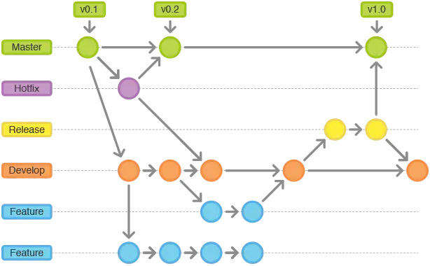
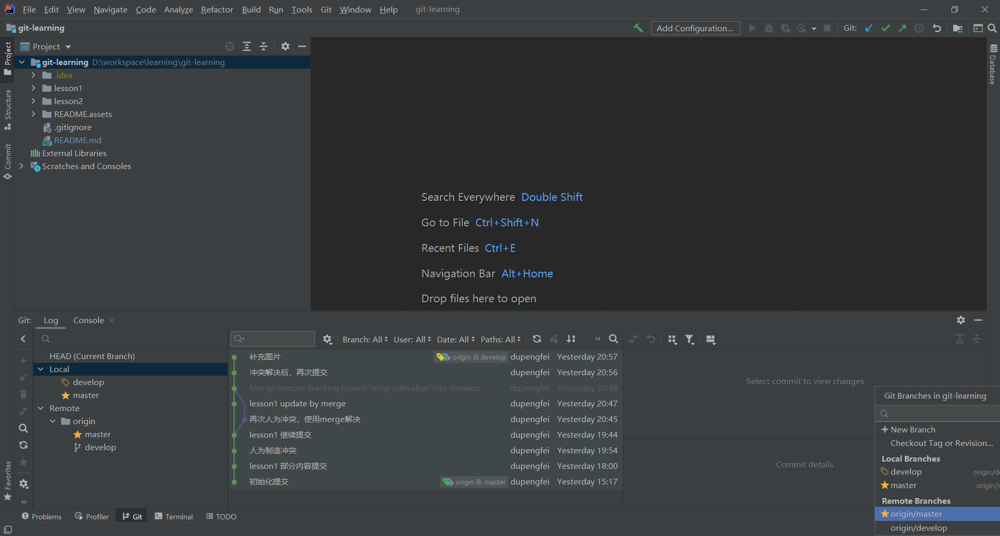

# 发布流程

整体流程上遵循Git Flow，具体实现根据项目实际情况有所调整

1. 每天晚上8点从develop全量取版本发布POC环境进行测试
2. 新的修改和POC环境的缺陷继续在develop分支开发
3. 准备发布正式环境时，从develop建了一个release分支，并发布至POC环境（或预发布环境），测试缺陷在release分支修改（分配问题时，需要描述清楚在哪个分支修改，没有特殊说明的，默认在develop分支修改），其他功能在develop分支修改
4. release测试通过后，合并至master发布正式版本，并标记tag，并且需要同步将release分支合并回develop分支（此步骤需要华资和创智坐在一起来完成）
5. 正式环境紧急缺陷，从master创建hotfix分支进行修复，修复完成后，同步合并至master和develop，如果存在未发布的release，也需要合并
6. 长期不能发布的功能，从develop创建feature分支进行开发，feature非必要不创建，减小合并压力

# 操作原则

1. 一个问题报告的修改，尽量只进行一次提交
2. 一次提交只包含一个问题报告的内容
3. 本地不要包含太多未提交的内容，尽量能做到本地代码是可以全量提交的（为什么做不到，需要收集素材来具体解决）

# 操作建议

1. 开始修改代码之前，先更新
2. 修改完成之后，先commit，再push
3. 不要急着push，本地多测试一下，再push
4. 本地测试发现错误，继续修改，修改后再次commit，为了做到一个问题报告只进行一次提交，后续提交使用 amend commit
5. 本地测试无误后，尝试push至远程仓库，如果提示有冲突，不要继续提交
6. push有冲突时，先更新，然后解决冲突，解决冲突有merge和rebase两种方式，建议使用rebase方式
7. 不要担心有冲突，大概率只是提交先后顺序问题，并不需要人工干预
8. 真的有冲突需要人工解决，能解决的自行解决，不知道怎么解决的，联系负责人协助解决
9. 解决冲突后，先本地测一测，没问题了再push

# 实操案例
* [lesson1 基本操作](./lesson1/README.md)
* [lesson2 获取远程分支信息](./lesson2/README.md)

# Q&A

1. local分支和remote分支有什么区别？切换分支时，是不是选哪个都一样？

git不同于svn，是分布式的版本控制工具，初次拉取远程仓库时，是在本地生成了一个和远程仓库完全一样的仓库，后续的绝大部分操作都是在对本地仓库进行修改，修改后我们的本地仓库和远程仓库就不再一致了。

那么怎么将这些修改推送至远程仓库呢？当我们要把本地修改同步到远程仓库时，可以使用push（约等于将本地仓库复制到远程仓库中）。此时可能会遇到一个问题，我修改了一个文件，push到远程仓库时，发现其他人也修改了这个文件，那么粗暴的将这个文件直接复制过去，就不合适了，此时就需要手工做一个处理，将这些修改整理一下，生成新的文件，再上传到远程仓库，这个处理过程也叫作解决冲突。

解决冲突有两种方式，merge和rebase，主要的差异在历史记录上。merge会同时保留这两个文件，然后建一个新的文件，用来保存解决冲突后的文件。rebase则是觉得建个新的文件多麻烦，直接在本地的文件上修改，修改成解决冲突后的内容就好了。

2. git和svn有什么区别，优缺点是什么？

最大的区别git是分布式的，svn是集中的；因此git断网也可以使用，svn不行。另外git在分支合并上比svn更加容易。

缺点也很明显，概念比svn要多，操作要复杂。
