模拟实际项目开发流程，依次进行如下操作，所有操作均在IDEA下完成：
1. 项目拉取(clone)
2. 切换分支(checkout)
3. 更新(pull)
4. 修改代码
5. 提交(commit)
6. 追加提交(amend commit)
7. 上传远程仓库(push)
8. 解决冲突(merge or rebase)
9. 再次上传

# 1. 项目拉取

> File -> New -> Project from Version Control

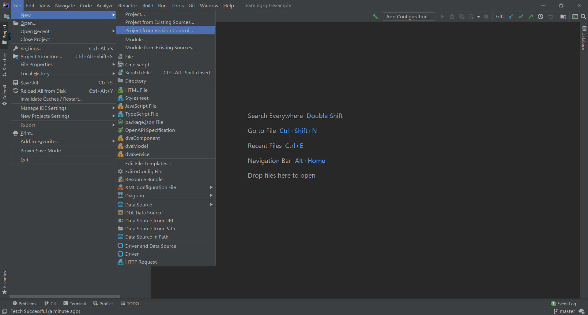

> 输入URL地址

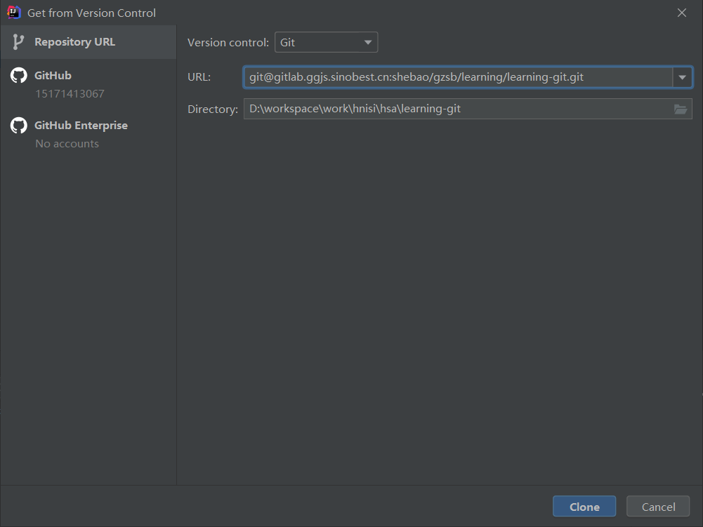

# 2. 切换分支

> 点击右下角的master，此区域显示当前分支名称

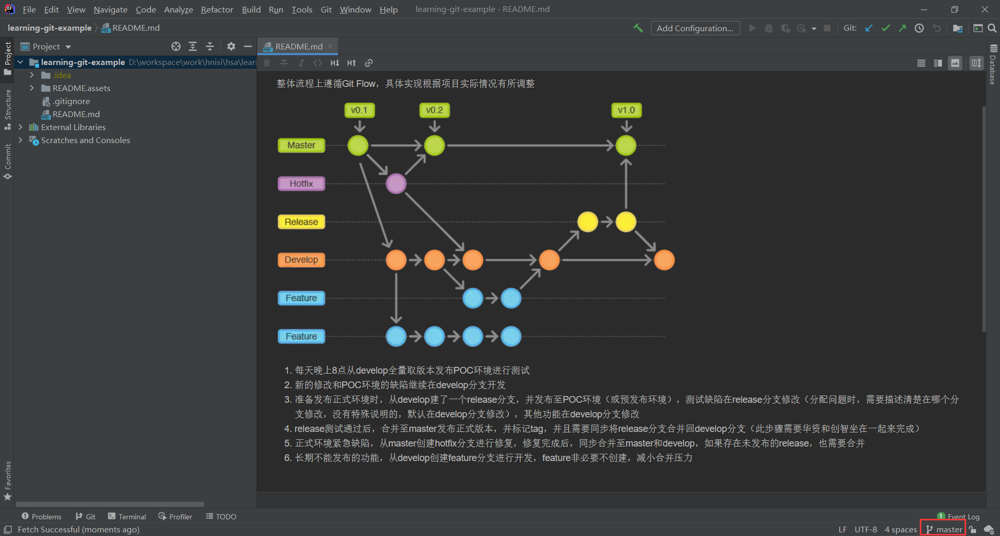

> 选择remote branches中的develop分支 -> checkout

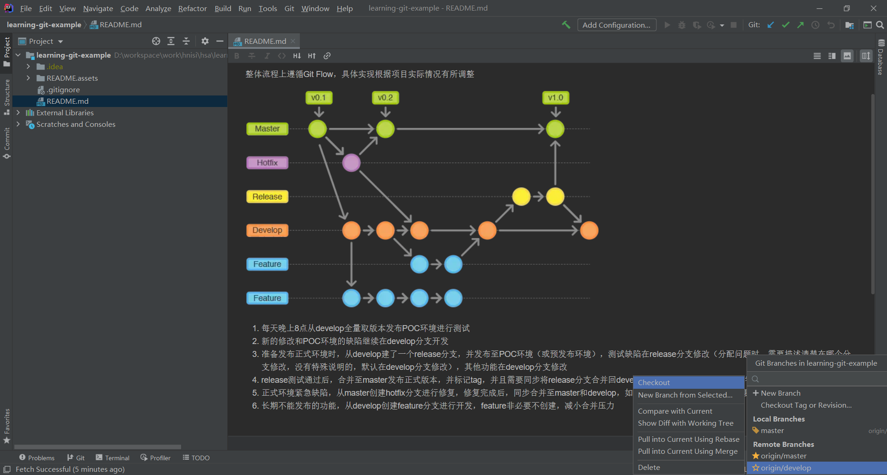

# 3. 更新(pull)

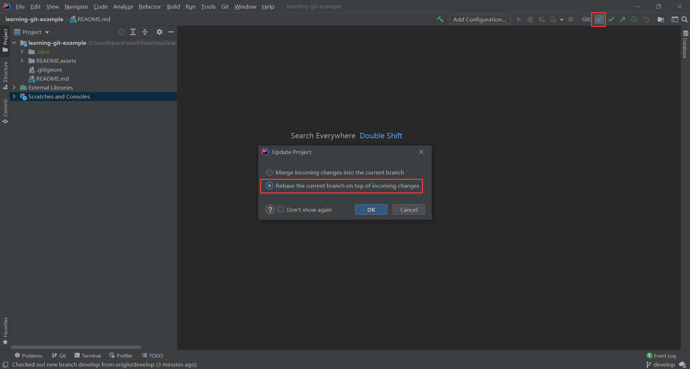

> 如果真的有更新，可以在git日志中看到更新的内容

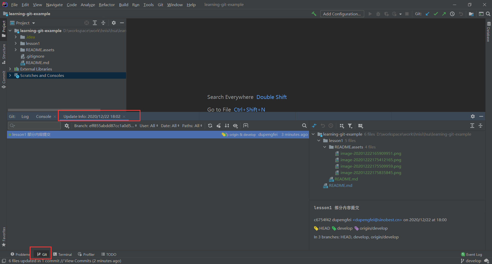

# 4. 修改代码

...

# 5. 提交(commit)

> 红色部分是未加入版本控制的，蓝色部分是修改的，灰色部分是删除的

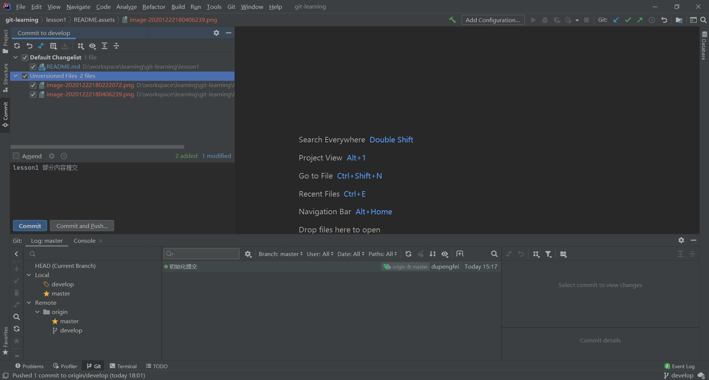

> 加入版本控制

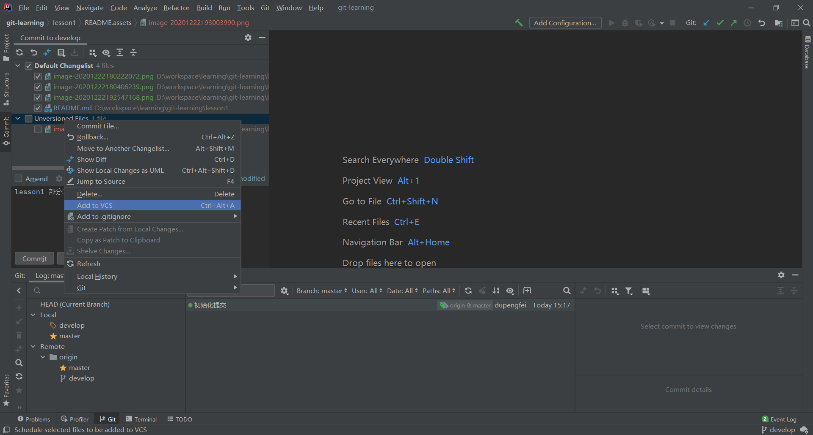

> 提交至本地，使用commit即可，不要commit and push

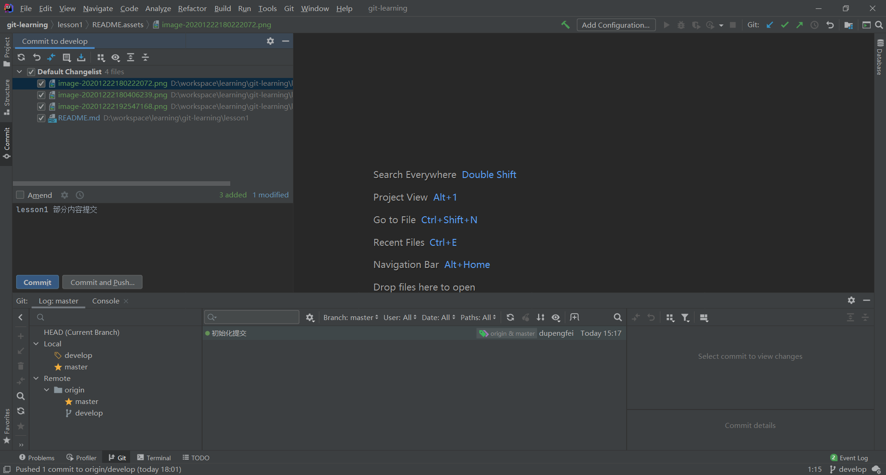

# 6. 追加提交(amend commit)

> 选中amend后，继续提交

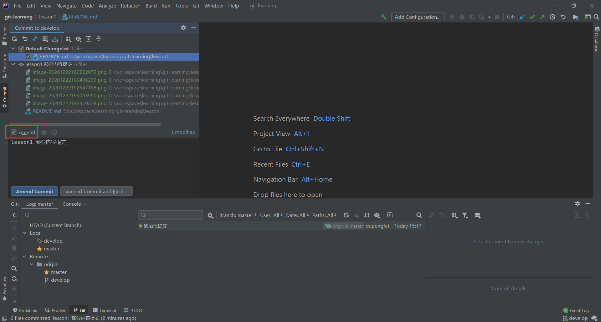

# 7. 上传远程仓库(push)

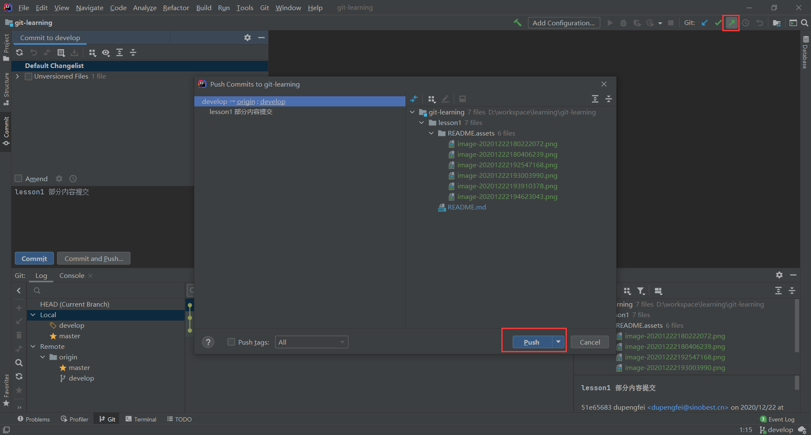

> 如果有冲突会提示push失败，此时选择cancel，不要直接尝试合并

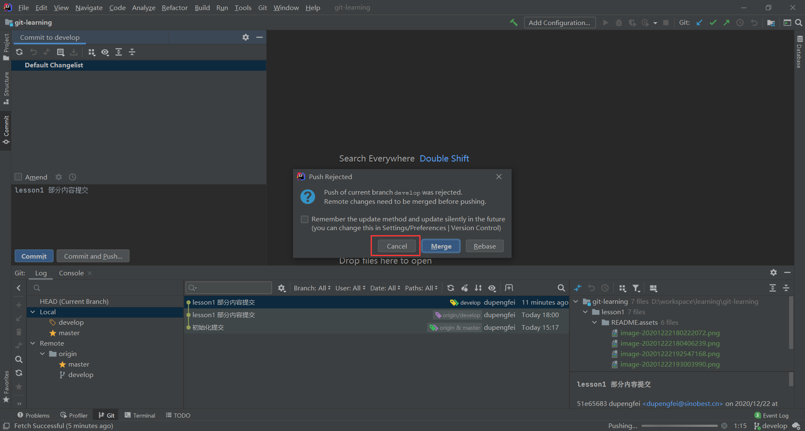

# 8. 解决冲突(merge or rebase)

## rebase

> 更新项目，解决冲突

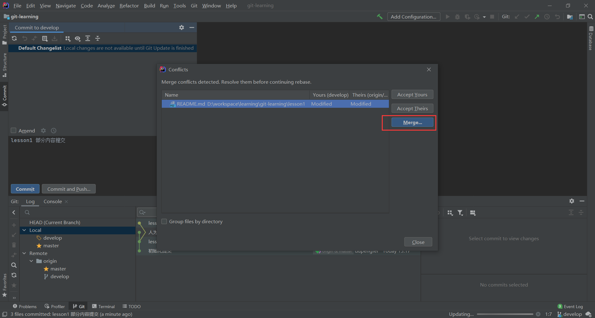

> 左边是本地的内容，右边是远程仓库的内容，中间的是合并后的结果
>
> 绿色的是没有冲突的部分，红色的是有冲突的地方，需要重点关注

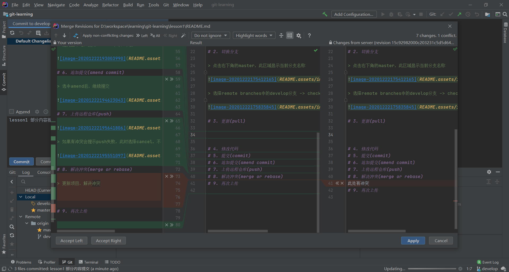

> 某一段代码没有问题，就选择箭头，表示接受，即可将对应区域的代码复制到中间区域
>
> 如果某段代码有问题，就选择叉叉，表示拒绝
>
> 完成接受或拒绝的操作后，如果代码还需要额外的调整，也可以在中间的区域直接修改

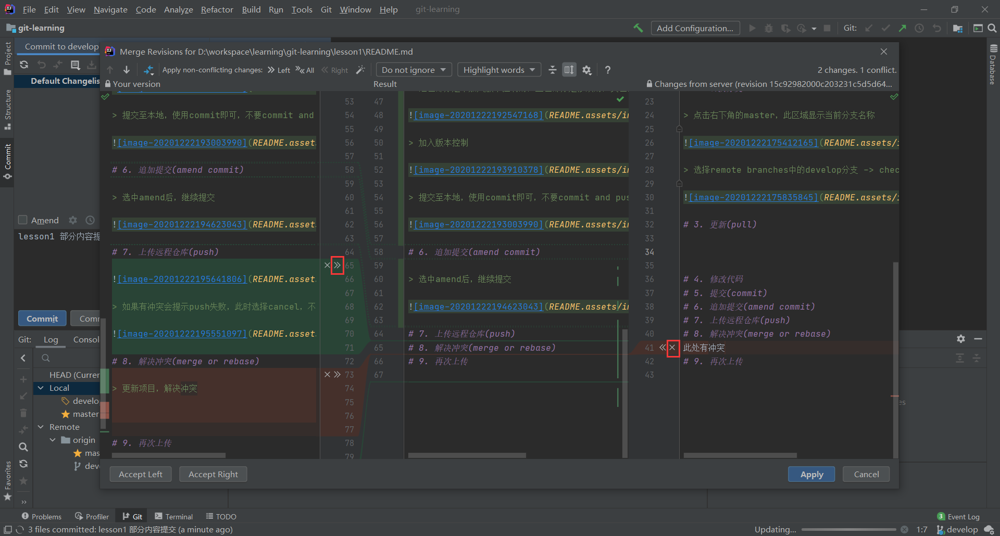

> 所有的冲突都解决后，就会出现如下提示，然后就可以apply，解决冲突

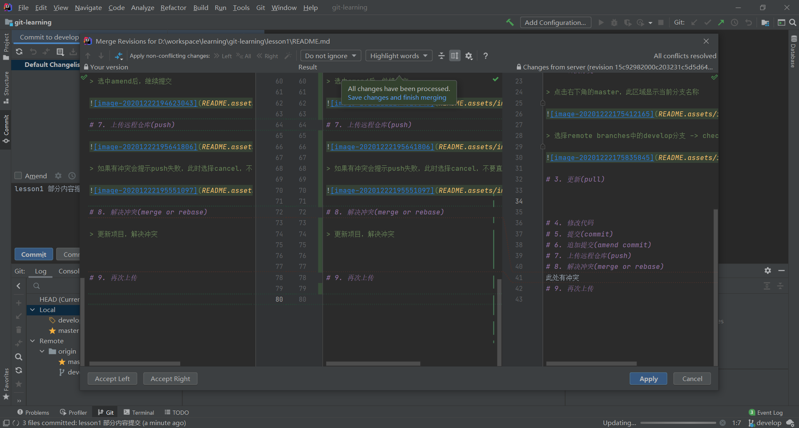

完成后，可以看到历史记录是一条直线，没有分叉

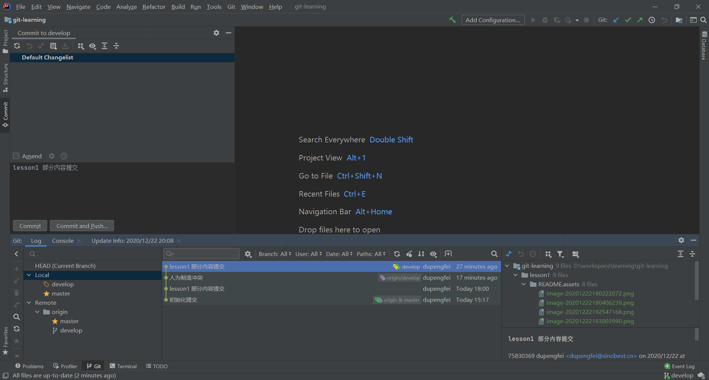

## merge

再次人为冲突，使用merge解决

# 9. 再次上传

